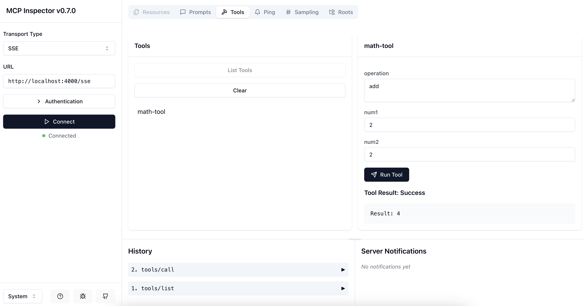

# Hello World MCP Server

Welcome to the **Hello World MCP Server**! This project demonstrates how to set up a server using the [Model Context Protocol (MCP)](https://github.com/modelcontextprotocol/sdk) SDK. It includes tools, prompts, and endpoints for handling server-sent events (SSE) and messages.

---

## Features

- **MCP Integration**: Uses the MCP SDK to create a server with tools and prompts.
- **Express Framework**: Handles HTTP endpoints for SSE and message communication.
- **Environment Configuration**: Uses `.env` files for easy configuration.
- **TypeScript Support**: Fully typed codebase for better developer experience.

---

## Prerequisites

Before you begin, ensure you have the following installed:

1. **Node.js** (v16 or higher) - [Download here](https://nodejs.org/)
2. **npm** (comes with Node.js) or **yarn**

---

## Getting Started

Follow these steps to set up and run the project:

### 1. Clone the Repository

If you haven't already, clone the repository to your local machine:

```bash
git clone https://github.com/your-username/hello-world-mcp-server.git
cd hello-world-mcp-server
```

### 2. Install Dependencies

Install the required dependencies using npm or yarn:

```bash
npm install
```

or

```bash
yarn install
```

### 3. Configure Environment Variables

The project uses a `.env` file to configure the server's port. A sample `.env.example` file is provided.

1. Copy the `.env.example` file to `.env`:

   ```bash
   cp .env.example .env
   ```

2. Open the `.env` file and update the `PORT` variable if needed. The default is `4000`.

   ```env
   PORT=4000
   ```

### 4. Build the Project

Compile the TypeScript code into JavaScript:

```bash
npm run build
```

This will generate the compiled files in the `dist` directory.

### 5. Run the Server

Start the server in production mode:

```bash
npm start
```

Alternatively, for development mode with live reloading, use:

```bash
npm run dev
```

---

## Testing the Server

### 1. Using the MCP Inspector

The MCP Inspector is a tool to test and inspect your MCP server. You can use it to verify that your tools and prompts are registered correctly.

Run the following command to inspect your server:

```bash
npx @modelcontextprotocol/inspector ./dist/server.js
```

This will open an interactive interface where you can test the tools and prompts registered in your server like below.



---

## Project Structure

Here’s an overview of the project structure:

```
hello-world-mcp-server/
├── src/
│   ├── server.ts                     # Main server entry point
│   ├── modules/
│   │   ├── tools.ts                  # Registers MCP tools
│   │   ├── prompts.ts                # Registers MCP prompts
│   │   └── transports.ts             # Handles SSE and message endpoints
├── .env                              # Environment variables
├── .env.example                      # Example environment variables
├── package.json                      # Project metadata and scripts
├── tsconfig.json                     # TypeScript configuration
└── README.md                         # Project documentation
```

---

## Troubleshooting

### Common Issues

1. **Port Already in Use**: If you see an error about the port being in use, update the `PORT` variable in the `.env` file.
2. **TypeScript Errors**: Ensure you’ve installed all dependencies and are using the correct Node.js version.

### Debugging

Use the following command to debug the server:

```bash
npm run dev
```

This will start the server with live reloading and detailed logs.

---

## Contributing

Contributions are welcome! Feel free to open issues or submit pull requests.

---

## License

This project is licensed under the ISC License. See the [LICENSE](LICENSE) file for details.
